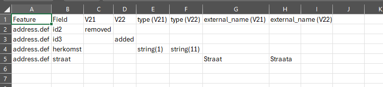

# Compare feature defs

## Usage

- basic

```bash
go run main.go -d1 ./d1 -d2 ./d2 
```

Result in CSV:

```bash
$ go run main.go -d1 ./d1 -d2 ./d2 
Feature,Field,Dir 1,Dir 2,type (Dir 1),type (Dir 2),external_name (Dir 1),external_name (Dir 2)
address.def,id2,removed,,,,,
address.def,id3,,added,,,,
address.def,herkomst,,,string(1),string(11),,
address.def,straat,,,,,Straat,Straata```
```

Displays difference what was removed and added between versions d1 and d2



- display not existing files

```bash
go run main.go -d1 ./d1 -d2 ./d2 -ne
```

Result:

```bash
Feature,Field,Dir 1,Dir 2,type (Dir 1),type (Dir 2),external_name (Dir 1),external_name (Dir 2)
address.def,id2,removed,,,,,
address.def,id3,,added,,,,
address.def,herkomst,,,string(1),string(11),,
address.def,straat,,,,,Straat,Straata
,,,,,,,
File d2\address2 copy.def not exists
```
